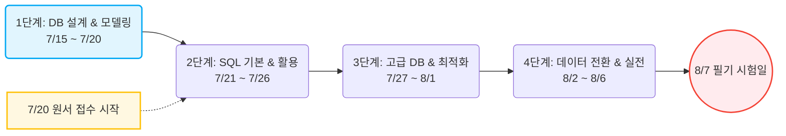

# 📅 정보처리기사 3과목 (데이터베이스 구축) D-23 합격 학습 계획서

<!-- workspace-readme-learning:start -->
## 파일과 연결한 학습 안내

이 폴더에 있는 문서·설정 파일을 기준으로 학습 위치를 정리했습니다.

### 주요 파일과 역할

현재 실행 소스가 확인되지 않습니다. README에 있는 계획·설명과 실제 구현 상태를 구분해 읽습니다.

### 실행과 설정 확인

- 현재 폴더는 문서·설정 중심입니다. 실행 소스가 확인되지 않은 기능을 실행 완료된 것으로 간주하지 않습니다.

### 관련 PDF와 보충 설명

- [7/15 강의](<../260629_ex/새 폴더/7-15/README.md>): ERD·키·함수 종속·정규화와 스키마 설계를 연결합니다.
- [6/16 강의](<../260629_ex/새 폴더/6-16/README.md>): 문서 작성과 회고를 문제·선택 근거·관찰 결과의 기록으로 연결합니다.

이 링크는 구현을 이해하기 위한 관련 기초 자료입니다. 해당 강의가 이 저장소의 모든 기능이나 이후 버전의 API를 설명한다는 뜻은 아닙니다.

### 읽는 순서와 복습

- 업무 데이터 → 키와 관계 → 테이블 분리 → 제약 조건 순으로 읽습니다. 삽입·수정·삭제 이상과 중복 데이터를 갱신하는 위치를 설명합니다.
- 원본 문서와 이를 보여 주는 화면·빌드 코드가 있으면 그 연결부터 읽습니다. 사실과 계획을 구분하고 코드 또는 기록으로 확인할 수 있는 근거를 연결합니다.

<!-- workspace-readme-learning:end -->

* **계획 작성 기준일:** 2026년 7월 14일
* **원서 접수일:** 2026년 7월 20일 (월) ⚠️
* **시험일:** 2026년 8월 7일 (금) 🎯
* **작성 당시 남은 기간:** 총 23일

---

## 🗺️ 맞춤형 학습 로드맵 (7/15 ~ 8/7)

---

## 📝 일자별 상세 학습 계획

### 1단계: DB 설계 및 데이터 모델링 (7/15 ~ 7/20)
> [!IMPORTANT]
> **7월 20일(월) 오전 10시**에 큐넷(Q-net) 필기 원서 접수가 시작됩니다. 잊지 말고 접수부터 완료하세요!

| 날짜 | 구분 | 학습 주제 | 상세 학습 내용 |
| :--- | :--- | :--- | :--- |
| **7/15 (수)** | Day 1 | 데이터베이스 정의 및 설계 | 데이터베이스 특징, 설계 5단계 (개념 ➡️ 논리 ➡️ 물리) |
| **7/16 (목)** | Day 2 | 데이터 모델링 및 E-R 모델 | 개체(Entity), 속성, 관계 및 E-R 다이어그램 표현법 |
| **7/17 (금)** | Day 3 | 관계 데이터 모델 및 무결성 | 릴레이션 구조(차수, 카디널리티), 키(기본키/외래키 등), 무결성 제약조건 |
| **7/18 (토)** | Day 4 | 정규화 (1) | 이상 현상(삽입/삭제/갱신), 정규화의 목적, 1~3정규형 |
| **7/19 (일)** | Day 5 | 정규화 (2) | BCNF, 4~5정규형, 반정규화(역정규화)의 정의 및 특징 |
| **7/20 (월)** | Day 6 | **원서 접수 & 1단계 복습** | 🔔 **필기 시험 원서 접수 완료하기** / 정규화 두음법 복습 (**도부이결다조**) |

---

### 2단계: SQL 기본 및 활용 (7/21 ~ 7/26)
> [!TIP]
> SQL 문법은 필기와 실기 모두에서 직접 코딩 문제로 출제되므로, 단순히 읽는 것보다 쿼리의 실행 결과를 직접 머릿속으로 그려보는 것이 중요합니다.

| 날짜 | 구분 | 학습 주제 | 상세 학습 내용 |
| :--- | :--- | :--- | :--- |
| **7/21 (화)** | Day 7 | DDL (데이터 정의어) | CREATE, ALTER, DROP 문법 및 CASCADE/RESTRICT 옵션 |
| **7/22 (수)** | Day 8 | DQL (기본 조회) | SELECT, WHERE 조건절, ORDER BY, DISTINCT, 와일드카드 |
| **7/23 (목)** | Day 9 | DML (데이터 조작어) | INSERT, UPDATE, DELETE 구문 및 DML 처리 특징 |
| **7/24 (금)** | Day 10 | DCL (데이터 제어어) | GRANT, REVOKE, COMMIT, ROLLBACK 권한 및 트랜잭션 제어 |
| **7/25 (토)** | Day 11 | JOIN (조인) | Inner Join, Left/Right Outer Join, Cross Join 구조 및 연산 |
| **7/26 (일)** | Day 12 | 서브쿼리 및 그룹화 | GROUP BY, HAVING, 집계 함수, 중첩 및 상관 서브쿼리 |

---

### 3단계: 고급 데이터베이스 및 성능 최적화 (7/27 ~ 8/1)
> [!NOTE]
> 트랜잭션의 ACID 특성, 병행 제어의 로킹 기법, 분산 DB 투명성 등은 객관식에서 말장난으로 오답을 유도하기 좋은 파트입니다. 명확한 정의를 외워야 합니다.

| 날짜 | 구분 | 학습 주제 | 상세 학습 내용 |
| :--- | :--- | :--- | :--- |
| **7/27 (월)** | Day 13 | 뷰(View)와 인덱스(Index) | 뷰의 가상 테이블 특징(물리적 저장 X), 인덱스의 장단점 |
| **7/28 (화)** | Day 14 | 트랜잭션 (ACID) | 트랜잭션 개념 및 특징 (**A**tomicity, **C**onsistency, **I**solation, **D**urability) |
| **7/29 (수)** | Day 15 | 병행 제어 및 교착 상태 | 병행 제어 목적, 문제점(갱신 분실 등), 로킹(Locking) 단위 |
| **7/30 (목)** | Day 16 | DB 회복(Recovery) 기법 | 로그 기반 회복(즉시/지연), 체크포인트, 그림자 페이지 |
| **7/31 (금)** | Day 17 | 절차형 SQL | 트리거(Trigger), 프로시저(Procedure), 사용자 정의 함수 특징 |
| **8/01 (토)** | Day 18 | 분산 DB 및 보안 | 분산 데이터베이스 투명성 4가지 (**위중병장**), 접근 통제(DAC, MAC, RBAC) |

---

### 4단계: 데이터 전환 및 실전 모의고사 (8/2 ~ 8/6)
> [!CAUTION]
> 시험 직전 5일입니다. 점수를 끌어올리기 가장 좋은 기간이므로 기출문제를 풀면서 오답 노트를 작성하고, 암기 리스트를 반복 회독해야 합니다.

| 날짜 | 구분 | 학습 주제 | 상세 학습 내용 |
| :--- | :--- | :--- | :--- |
| **8/02 (일)** | Day 19 | 데이터 전환 및 물리 DB 설계 | ETL 프로세스, 파티셔닝(범위, 해시 등) 기법 |
| **8/03 (월)** | Day 20 | 기출문제 풀이 (1) | 최근 2개년 기출문제 중 3과목 집중 풀이 및 오답 정리 |
| **8/04 (화)** | Day 21 | 기출문제 풀이 (2) | 자주 틀리는 파트(정규화, JOIN 쿼리) 기본서 이론 재확인 |
| **8/05 (수)** | Day 22 | 최종 요약집 회독 | 전체 핵심 키워드 및 암기 공식 빠르게 리마인드 |
| **8/06 (목)** | Day 23 | 실전 대비 최종 점검 | 모의고사 1회 풀이 및 오답노트 정독 후 컨디션 관리 |
| **8/07 (금)** | **D-Day** | **시험 당일** | 🎯 **정보처리기사 필기 시험 합격!** |

---

## 💡 필수 암기 요약집 (시험장 직전 회독용)

1. **정규화 단계:** 도 ➡️ 부 ➡️ 이 ➡️ 결 ➡️ 다 ➡️ 조
   * 1NF: **도**메인 원자값
   * 2NF: **부**분 함수적 종속 제거
   * 3NF: **이**행적 종속 제거
   * BCNF: **결**정자이면서 후보키가 아닌 것 제거
   * 4NF: **다**치 종속 제거
   * 5NF: **조**인 종속 제거
2. **트랜잭션 ACID 특징:**
   * **원자성(Atomicity):** All or Nothing (모두 반영되거나 아예 안 되거나)
   * **일관성(Consistency):** 트랜잭션 성공 후 언제나 일관된 DB 상태 유지
   * **격리성/고립성(Isolation):** 둘 이상의 트랜잭션이 동시에 실행될 때 끼어들기 불가
   * **영속성(Durability):** 성공한 트랜잭션의 결과는 시스템 장애가 나도 영구 보존
3. **분산 데이터베이스 투명성:** **위중병장**
   * **위치** 투명성, **중복** 투명성, **병행** 투명성, **장애** 투명성

<!-- pdf-til-supplement:start -->
## TIL 부연 설명 — PDF와 연결하기

기존 실습 내용을 이해하기 위한 PDF 기반 부연 설명이다. 아래 예시는 개념을 설명하기 위한 것이며, 이 프로젝트에서 실행해 관찰한 결과와는 구분한다. 페이지 번호는 표지를 포함한 PDF 순서다.

### 정규화는 중복된 사실을 한곳에서 관리하기

정규화는 같은 사실이 여러 행에 반복되어 생기는 삽입·수정·삭제 이상을 줄이는 설계 과정이다. 먼저 후보키와 함수 종속을 파악해야 하며 테이블을 많이 나누는 것 자체가 목적은 아니다. 반정규화는 읽기 비용을 줄이는 대신 중복 데이터의 일관성을 유지할 비용을 만든다.

**예시로 이해하기:** 주문마다 고객 주소를 현재 고객 정보로 중복 저장하면 주소 변경 시 여러 행이 어긋날 수 있다. 다만 주문 당시 배송지를 보관하는 것은 과거 사실의 스냅샷이라는 다른 목적이다. “현재 값”과 “당시 값”을 구분한 뒤 테이블을 설계한다.

근거: 313 데이터베이스 설계와 정규화 — [16쪽](<../260629_ex/새 폴더/7-15/313_데이터베이스_설계와_정규화.pdf#page=16>) · [17쪽](<../260629_ex/새 폴더/7-15/313_데이터베이스_설계와_정규화.pdf#page=17>) · [26쪽](<../260629_ex/새 폴더/7-15/313_데이터베이스_설계와_정규화.pdf#page=26>) · [27쪽](<../260629_ex/새 폴더/7-15/313_데이터베이스_설계와_정규화.pdf#page=27>) · [29쪽](<../260629_ex/새 폴더/7-15/313_데이터베이스_설계와_정규화.pdf#page=29>)

### 배운 내용을 재현 가능한 TIL로 남기기

TIL은 사용한 기술 이름을 나열하는 데서 한 걸음 더 나아가 문제, 선택한 방법, 관찰 결과를 연결하는 기록이다. “왜 이 방법을 썼는가”와 “어떤 입력에서 확인했는가”를 적어야 나중에 다른 상황에도 적용할 수 있다. 실행하지 않은 예상 결과는 실제로 관찰한 결과와 구분한다.

**예시로 이해하기:** 예를 들어 “비동기를 배웠다” 대신 “타이머가 마지막에 출력되는 이유를 예상하고 실행 순서를 비교했다”처럼 적는다. 코드 링크, 입력값, 실제 출력, 틀렸던 가설을 함께 남기고 PDF의 개념 설명은 그 관찰을 해석하는 근거로 연결한다.

근거: 202 취업 목적의 개발자 회고 작성법 — [5쪽](<../260629_ex/새 폴더/6-16/202_취업_목적의_개발자_회고_작성법.pdf#page=5>) · [8쪽](<../260629_ex/새 폴더/6-16/202_취업_목적의_개발자_회고_작성법.pdf#page=8>) · [10쪽](<../260629_ex/새 폴더/6-16/202_취업_목적의_개발자_회고_작성법.pdf#page=10>) · [12쪽](<../260629_ex/새 폴더/6-16/202_취업_목적의_개발자_회고_작성법.pdf#page=12>)

<!-- pdf-til-supplement:end -->
